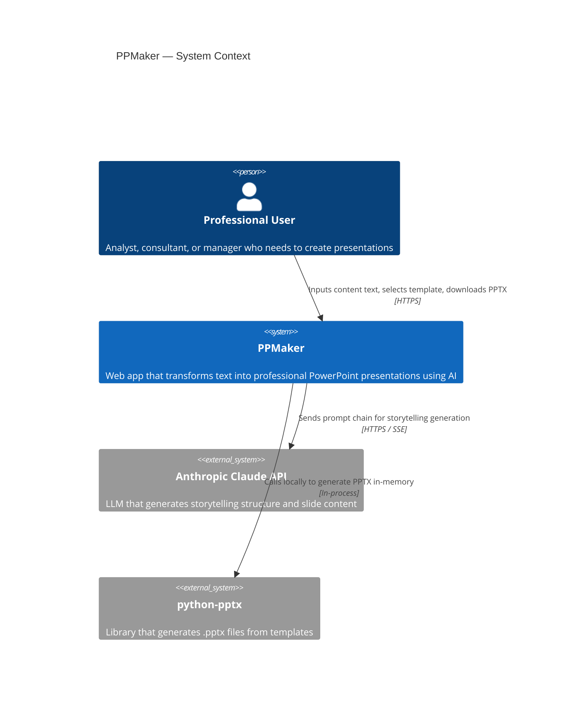
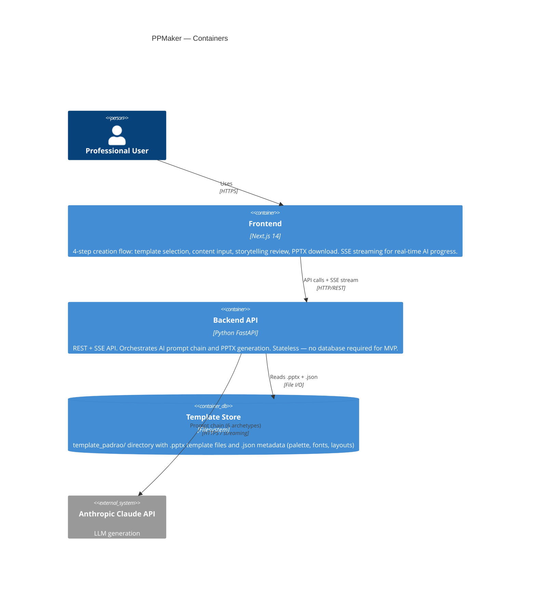
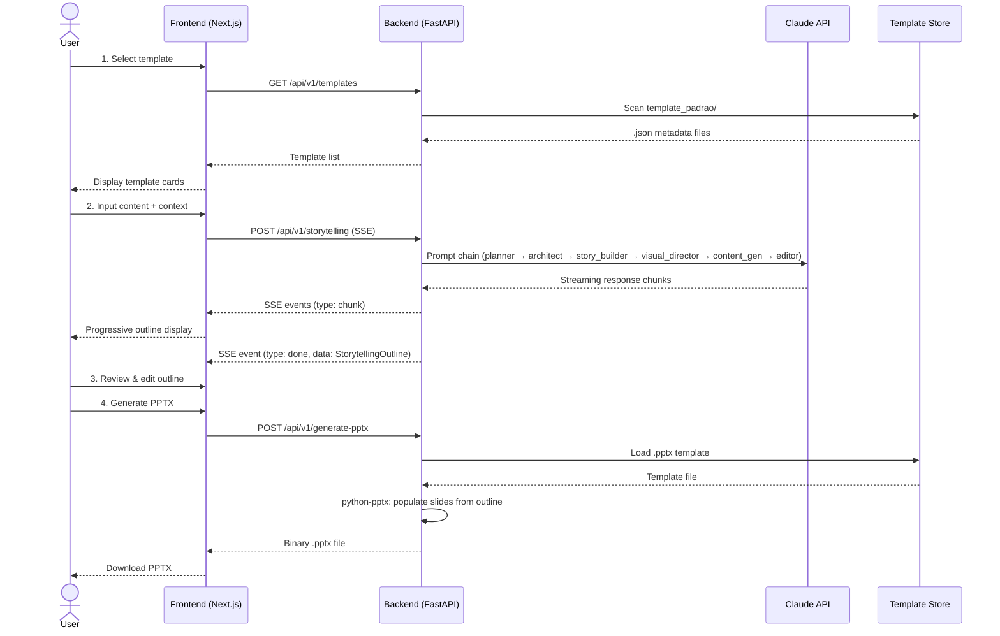

# PPMaker — System Context (C4 Level 1)

## Context Diagram

## Container Diagram (C4 Level 2)

## Data Flow (Sequence)

## Key Architectural Decisions

| # | Decision | ADR |
|---|----------|-----|
| 1 | SSE for streaming AI responses (not polling or WebSockets) | [ADR-001](ADR-001-sse-vs-polling.md) |
| 2 | python-pptx for PPTX generation (not Aspose or LibreOffice) | [ADR-002](ADR-002-pptx-generation.md) |
| 3 | Dashed-border rectangles for placeholder slides | [ADR-003](ADR-003-placeholder-strategy.md) |
